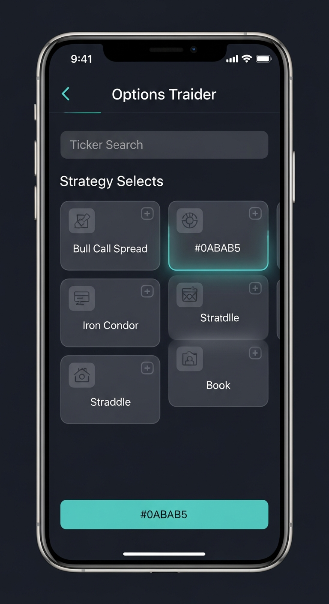
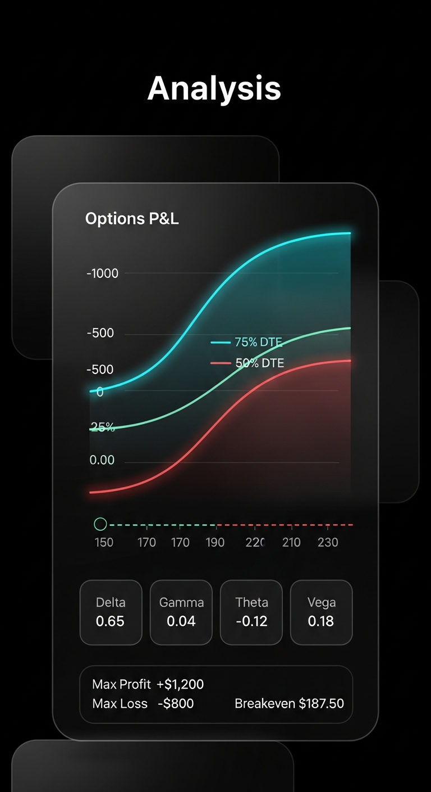
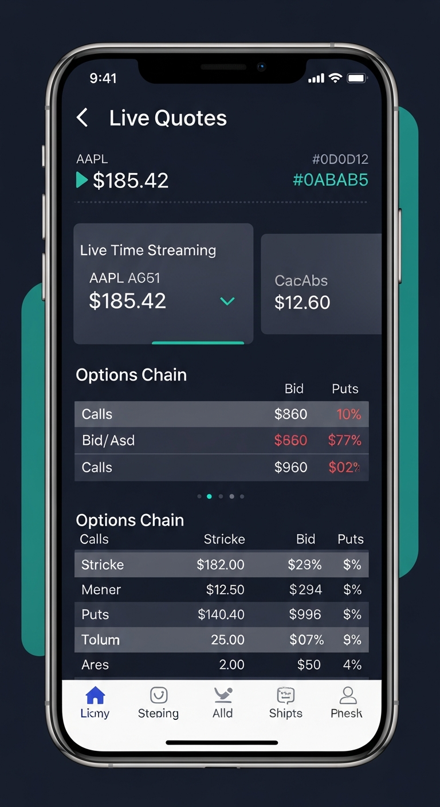
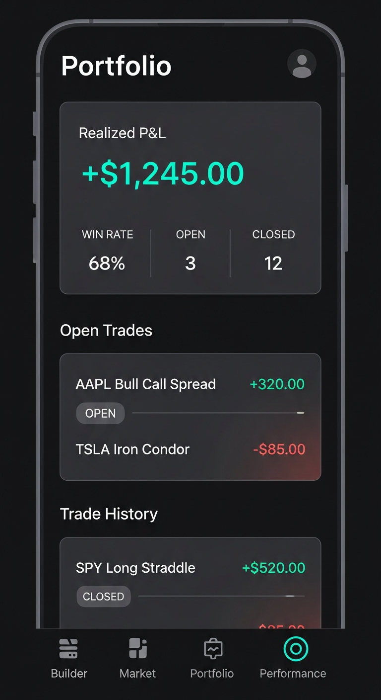
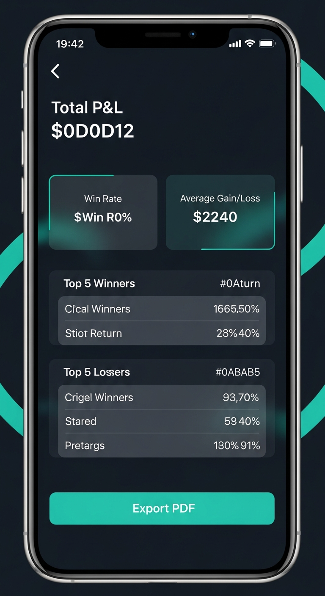
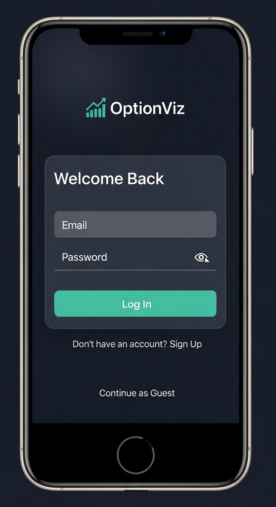

# OptionViz Mobile

  <p align="center">
    
    
    
  </p>

  <p align="center">
    <b>Options strategy analysis, portfolio management, and trade tracking — built with Expo React Native.</b>
  </p>

  <p align="center">
    
    
    
  </p>

  ---

  ## Features

  ### Strategy Builder
  - **12+ strategy templates** organized by category — Basic, Spreads, Income, Volatility, Neutral, Hedging
  - **Custom strategies** — build from scratch by adding individual option legs
  - **Any US stock ticker** — search from 90+ popular symbols or enter any ticker
  - **Interactive P&L charts** — profit/loss at expiration with SVG line visualization
  - **Time-decay curves** — dashed overlay lines at 75%, 50%, 25% DTE via Black-Scholes per-leg pricing
  - **Greeks display** — Delta, Gamma, Theta, Vega, Rho for every strategy
  - **Break-even analysis** — automatically calculated and plotted on charts
  - **Max Profit / Max Loss** cards with color-coded indicators

  ### Market Data (3 Views)
  - **Live Quotes** — auto-refreshing every 3–5 seconds with streaming SSE. Price, change %, company name for all tickers
  - **Options Chain** — full chain by expiration date with strike, bid, ask, volume, OI, IV%, and delta. Calls/Puts toggle
  - **Options Flow** — highest volume flow entries with Bullish/Bearish/Neutral sentiment tags, Put/Call Ratio card with volume & OI ratios

  ### Portfolio & Trade Tracking
  - **Open trades** with live P&L — real-time unrealized gains/losses updated every 5 seconds
  - **Close @ Live** — one-tap close at current market value with haptic feedback
  - **Close Manual** — enter a custom exit price
  - **Edit trades** — adjust leg quantities and entry cost after opening
  - **Trade history** — full record of closed trades with realized P&L
  - **Save strategies** to portfolio with expandable P&L analysis

  ### Performance Dashboard
  - **Realized P&L** — total return over selectable timeframes (1W, 1M, 3M, 6M, 1Y, ALL)
  - **Win Rate** — winners vs. losers breakdown
  - **Profit Factor** — ratio of average wins to average losses
  - **Best/Worst Trade** — top and bottom individual trade results
  - **PDF Export** — generate and share performance reports

  ### Authentication
  - **Email & password** registration and login with bcrypt hashing (12 salt rounds)
  - **Guest mode** — full app access with a 30-minute inactivity timeout
  - **Secure sessions** — tokens stored in Expo SecureStore
  - **Profile menu** — bottom sheet with account info, stats, and sign-out

  ---

  ## Design

  Liquid Glass dark theme with **Tiffany blue** (#0ABAB5) accent.

  | Token | Value | Usage |
  |-------|-------|-------|
  | Background | `#0D0D12` | App background |
  | Card | `#161620` | Panel/card backgrounds |
  | Glass | `rgba(255,255,255,0.03)` | Glassmorphic overlays |
  | Glass Border | `rgba(255,255,255,0.08)` | Subtle luminous borders |
  | Accent | `#0ABAB5` | Primary action, highlights |
  | Red | `#F43F5E` | Loss, errors, destructive |
  | Blue | `#38BDF8` | Info, secondary accent |
  | Gold | `#FBBF24` | Warnings, neutral |
  | Purple | `#A78BFA` | Special highlights |
  | Text Primary | `#EAEAF0` | Main text |
  | Text Secondary | `#8B8B9E` | Supporting text |

  Typography: **Inter** font family (400 Regular, 500 Medium, 600 SemiBold, 700 Bold).

  Full design specification: [`docs/DESIGN_SPEC.md`](docs/DESIGN_SPEC.md)

  ---

  ## Tech Stack

  | Layer | Technology |
  |-------|-----------|
  | Mobile App | Expo SDK 53, React Native, TypeScript |
  | Navigation | Expo Router with native bottom tabs |
  | Data Fetching | TanStack React Query (auto-refresh, SSE streaming) |
  | Charts | `react-native-svg` — custom P&L chart component |
  | Backend | Express.js with TypeScript |
  | Auth | bcryptjs password hashing, session tokens |
  | Database | PostgreSQL with Drizzle ORM |
  | Haptics | `expo-haptics` for tactile feedback |
  | PDF Export | `expo-print` + `expo-sharing` |

  ---

  ## Architecture

  ```
  artifacts/
    api-server/                  # Express API backend
      src/
        lib/marketData.ts            # Market data generation (any ticker)
        routes/
          auth.ts                    # Register, login, logout (bcrypt)
          market.ts                  # Quotes, chain, flow, PCR, SSE
          strategy.ts                # P&L analysis with Black-Scholes
          strategies.ts              # CRUD for saved strategies
          health.ts                  # Health check endpoint
    mobile/                      # Expo React Native app
      app/
        _layout.tsx                  # Root layout with AuthGate
        (tabs)/
          index.tsx                  # Builder tab (strategy wizard)
          market.tsx                 # Market tab (quotes/chain/flow)
          portfolio.tsx              # Portfolio & trades tab
          performance.tsx            # Performance dashboard tab
      components/
        AuthScreen.tsx               # Login / register form
        ProfileMenu.tsx              # Profile bottom sheet drawer
        PnLChart.tsx                 # SVG P&L chart with time-decay
        LegRow.tsx                   # Option leg display row
        MetricCard.tsx               # Stats display card
        GreeksBar.tsx                # Greeks visualization bar
        ErrorBoundary.tsx            # Error fallback UI
      constants/
        colors.ts                    # Liquid Glass color palette
        strategies.ts                # 12+ strategy template definitions
      context/
        AppContext.tsx                # Auth, guest timeout, analytics
      hooks/
        useApi.ts                    # API client with React Query
      lib/
        analytics.ts                 # Event tracking (all app events)
        auth.tsx                     # Auth utilities (SecureStore)
  lib/
    db/                          # Shared Drizzle ORM schema & client
  docs/
    DESIGN_SPEC.md               # Full design system specification
    images/                      # App screenshots
  ```

  ---

  ## API Endpoints

  ### Authentication
  | Endpoint | Method | Description |
  |----------|--------|-------------|
  | `/api/auth/register` | POST | Create account (email, password, firstName, lastName) |
  | `/api/auth/login` | POST | Login with email & password |
  | `/api/auth/logout` | POST | End session |
  | `/api/auth/user` | GET | Get current user (Bearer token) |

  ### Market Data
  | Endpoint | Method | Description |
  |----------|--------|-------------|
  | `/api/market/quote/:ticker` | GET | Single ticker quote |
  | `/api/market/batch-quotes` | POST | Batch quotes for multiple tickers |
  | `/api/market/expirations/:ticker` | GET | Available expiration dates |
  | `/api/market/chain/:ticker/:expiration` | GET | Full options chain with Greeks |
  | `/api/market/flow/:ticker` | GET | Options flow (highest volume) |
  | `/api/market/pcr/:ticker` | GET | Put/Call ratio (volume + OI) |
  | `/api/market/stream/:ticker` | GET | SSE streaming quotes (3s interval) |

  ### Strategy Analysis
  | Endpoint | Method | Description |
  |----------|--------|-------------|
  | `/api/strategy/analyze` | POST | P&L analysis with time-decay curves & Greeks |
  | `/api/strategies` | GET | List saved strategies |
  | `/api/strategies` | POST | Save a strategy |
  | `/api/strategies/:id` | DELETE | Delete a saved strategy |

  ---

  ## Getting Started

  ```bash
  # Install dependencies
  pnpm install

  # Start the API server
  pnpm --filter @workspace/api-server run dev

  # Start the Expo app
  pnpm --filter @workspace/mobile run dev
  ```

  Scan the QR code with Expo Go (iOS/Android) or press `i` for iOS simulator / `a` for Android emulator.

  ---

  ## Analytics Events

  | Event | Trigger |
  |-------|---------|
  | `APP_OPENED` | App comes to foreground |
  | `APP_BACKGROUNDED` | App goes to background |
  | `GUEST_SESSION_STARTED` | User continues as guest |
  | `GUEST_SESSION_EXPIRED` | 30-min inactivity timeout |
  | `PROFILE_MENU_LOGIN_TAPPED` | Guest taps "Log In / Sign Up" |
  | `STRATEGY_ANALYZED` | Strategy analysis completed |
  | `STRATEGY_SAVED` | Strategy saved to portfolio |
  | `TRADE_OPENED` | New trade opened |
  | `TRADE_CLOSED` | Trade closed (live or manual) |
  | `TRADE_EDIT_SAVED` | Trade quantities/cost edited |
  | `PDF_EXPORTED` | Performance report exported |

  ---

  ## Screenshots

  | Auth | Builder | P&L Chart |
  |:----:|:-------:|:---------:|
  |  |  |  |

  | Market Data | Portfolio | Performance |
  |:-----------:|:---------:|:-----------:|
  |  |  |  |

  ---

  ## License

  MIT
  