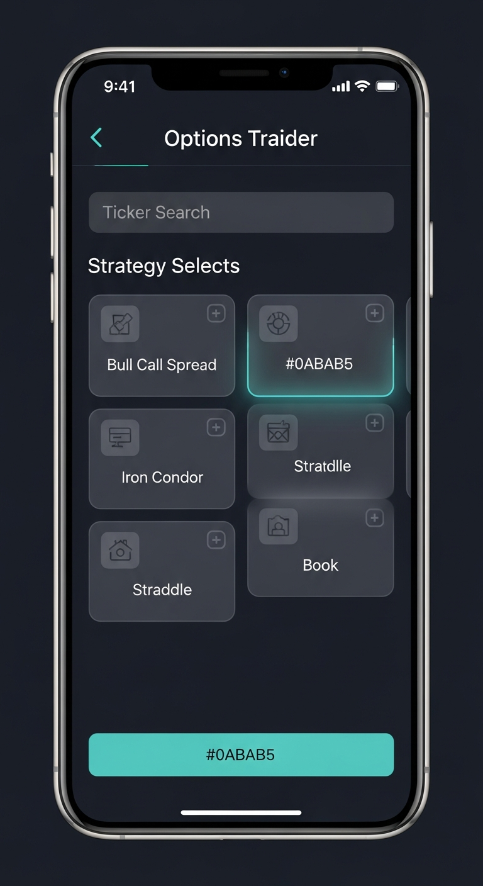

# OptionViz

A full-featured options strategy builder, visualizer, and paper-trading companion built with Expo React Native and an Express API backend. Design multi-leg options strategies, analyze P&L with Black-Scholes time-decay curves, track trades with live unrealized P&L, and export professional performance reports.

> **Current release: v3.4.0**



## Feature Overview

### Strategy Builder (4-step wizard)
- **12+ strategy templates** organized by category:
  - *Basic*: Long Call, Long Put
  - *Spreads*: Bull Call Spread, Bear Put Spread, Iron Condor, Iron Butterfly, Calendar Spread
  - *Income*: Covered Call, Cash-Secured Put
  - *Volatility*: Long Straddle, Long Strangle
  - *Neutral*: Short Straddle, Short Strangle
  - *Hedging*: Protective Put, Collar
- **Custom strategy builder** — add/remove individual option legs freely beyond templates
- **Most Active tickers** — glassmorphic live quote rows (SPY, AAPL, TSLA, NVDA, AMD, MSFT, QQQ, META, AMZN, GOOGL) with color-coded change %
- **Live midpoint pricing** — each leg shows bid/ask/mid from the options chain, auto-refreshed every 5 seconds
- **Editable contract sizes** — +/- quantity steppers per leg
- **Step-by-step back navigation** — analysis → legs → template → ticker via header back arrow
- **Margin calculator** — full Reg-T margin logic (naked call/put 20%/10% methods, credit/debit spread detection, multi-leg defined-risk pairing) with margin requirement card and buying-power impact

### Analysis
- **P&L charts** with interactive expiration payoff visualization
- **Time-decay curves** — dashed overlays at 75%/50%/25% DTE computed via per-leg Black-Scholes pricing
- **Greeks** — Delta, Gamma, Theta, Vega per leg and net
- **Break-even points, max profit / max loss** cards
- **Margin requirement and buying-power impact** metric cards

### Market Tab (3 views)
- **Live Quotes** — SSE-streamed quotes with auto-refresh; build button deep-links into the Builder with the ticker pre-filled
- **Options Chain** — full calls/puts chain with strike, bid, ask, volume, open interest, IV%, and delta across multiple expirations
- **Options Flow** — highest-volume flow entries with sentiment tags plus a Put/Call Ratio card (volume ratio, OI ratio, visual bar); flow entries deep-link to the Builder with call/put template pre-selected

### Portfolio (3 sub-tabs)
- **Dashboard** — editable account balance (persisted), stock positions (ticker/shares/avg cost) with live P&L from batch quotes, and total portfolio value (cash + live positions)
- **Saved Strategies** — synced to PostgreSQL for logged-in users, local for guests
- **Trades** — open trades directly from the Builder using live midpoints as entry prices; live unrealized P&L; edit entry costs, close at live prices or manually, delete trades

### Performance
- Total realized P&L, trade counts, win rate %, average gain/loss
- **Rate of Return** — overall ROR, total capital deployed, average holding days, per-trade annualized ROR
- Top 5 winners/losers ranked by dollar P&L and percentage return
- Timeframe filtering (1W/1M/3M/6M/1Y/ALL)
- **PDF export** — professionally styled report with stats grid, top winners/losers, open positions, and all closed trades (via expo-print + expo-sharing)

### Authentication & Sessions
- Email/password auth (bcryptjs, 12 salt rounds) with server-side sessions
- Mobile stores the session token in expo-secure-store and sends it as an Authorization header
- **Guest mode** — full functionality with local AsyncStorage persistence; 30-minute inactivity timeout clears guest data
- Profile menu drawer with user stats, preferences, sign-out, and "Log In / Sign Up" for guests

## Market Data: Live via Yahoo Finance

Quotes, expirations, and options chains are now served **live from Yahoo Finance** (via `yahoo-finance2`, no API key required). The previous synthetic engine (seeded randomness + Black-Scholes pricing) remains as an **explicit, logged fallback** when the live source is unavailable, so the app keeps working offline or under rate limits. Data is for education and analysis — not a substitute for broker-grade quotes when placing real trades.

## Tech Stack

| Layer | Technology |
|-------|------------|
| Mobile | Expo React Native (SDK 54), expo-router, React Query |
| Backend | Express 5 + TypeScript (tsx dev, esbuild CJS bundle for prod) |
| Database | PostgreSQL + Drizzle ORM |
| API contract | OpenAPI 3.1 + Orval codegen (React Query hooks, Zod schemas) |
| Auth | bcryptjs + server-side sessions, expo-secure-store on device |
| Charts | react-native-svg custom P&L chart |
| Monorepo | pnpm workspaces, TypeScript project references |

## Architecture

```
artifacts/
  api-server/              # Express API backend
    src/
      lib/marketData.ts        # Simulated market data engine (any ticker)
      lib/blackScholes.ts      # Black-Scholes pricing + Greeks
      lib/auth.ts              # Session CRUD
      middlewares/authMiddleware.ts
      routes/market.ts         # Quote, chain, flow, PCR, SSE endpoints
      routes/strategy.ts       # Strategy analysis
      routes/auth.ts           # Register / login / logout
      routes/strategies.ts     # Strategy CRUD (persisted)
  mobile/                  # Expo React Native app (OptionViz)
    app/(tabs)/
      index.tsx                # Builder — 4-step strategy wizard
      market.tsx               # Market — quotes / chain / flow
      portfolio.tsx            # Portfolio — dashboard / strategies / trades
      performance.tsx          # Performance — stats + PDF export
    components/              # PnLChart, LegRow, GreeksBar, AuthScreen, ...
    context/AppContext.tsx   # Auth state, strategy/trade persistence
    lib/marginCalc.ts        # Reg-T margin requirement engine
    constants/strategies.ts  # Strategy template definitions
lib/
  api-spec/                # OpenAPI spec + Orval codegen config
  api-client-react/        # Generated React Query hooks
  api-zod/                 # Generated Zod schemas
  db/                      # Drizzle schema (users, saved_strategies)
```

## API Endpoints

| Endpoint | Method | Description |
|----------|--------|-------------|
| `/api/market/quote/:ticker` | GET | Single quote |
| `/api/market/batch-quotes` | POST | Batch quotes |
| `/api/market/expirations/:ticker` | GET | Available expirations |
| `/api/market/chain/:ticker/:expiration` | GET | Options chain with Greeks |
| `/api/market/flow/:ticker` | GET | Options flow (highest volume) |
| `/api/market/pcr/:ticker` | GET | Put/Call ratio (volume + OI) |
| `/api/market/stream/:ticker` | GET | SSE streaming quotes |
| `/api/strategy/analyze` | POST | Strategy P&L analysis with time-decay curves |
| `/api/auth/register` | POST | Register (email/password) |
| `/api/auth/login` | POST | Login |
| `/api/auth/logout` | POST | Clear session |
| `/api/auth/user` | GET | Current authenticated user |
| `/api/strategies` | GET/POST | List / save user strategies |
| `/api/strategies/:id` | DELETE | Delete strategy |

## Security Hardening

- Ticker input sanitization on all market routes + SSE stream (`/^[A-Za-z.]{1,10}$/`)
- Expiration date and strategy payload validation; batch-quote payload filtering
- Auth routes and middleware wrapped in try/catch to prevent DB-failure crashes
- HTML escaping of user-controlled strings in PDF generation
- Dependency vulnerability remediation via pnpm overrides (`ws`, `qs`, `uuid` — all resolved to patched releases; workspace audit clean of those advisories)
- Supply-chain defense: minimum release age enforced for npm packages

## Design System — "Liquid Glass"

| Element | Color |
|---------|-------|
| Background | `#0D0D12` |
| Card | `#161620` |
| Elevated | `#1C1C28` |
| Glass | `rgba(255,255,255,0.03)` |
| Glass border | `rgba(255,255,255,0.08)` |
| Accent (Tiffany Blue) | `#0ABAB5` |
| Red / Blue / Gold / Purple | `#F43F5E` / `#38BDF8` / `#FBBF24` / `#A78BFA` |

Typography: Inter (400/500/600/700). Full spec in [`docs/DESIGN_SPEC.md`](docs/DESIGN_SPEC.md).

## Getting Started

```bash
# Install dependencies
pnpm install

# Typecheck everything
pnpm run typecheck

# Start API server
pnpm --filter @workspace/api-server run dev

# Start Expo app
pnpm --filter @workspace/mobile run dev
```

## Summer Release (July 2026)

The Summer Release moves OptionViz from a simulated sandbox to live market data, hardens security across the stack, and ships production-ready builds.

### Live market data
- Quotes, expirations, and options chains now stream **live from Yahoo Finance** (`yahoo-finance2`, no API key required)
- The simulated Black-Scholes engine remains as an explicit, logged fallback so the app keeps working offline or under rate limits
- Fixed a production-only startup crash caused by ESM/CJS interop in the bundled server, verified with a production health-check smoke test

### Security hardening
- **Auth protection** — rate limiting and account lockout on login/register endpoints; minimum password length raised to 8
- **Dependency vulnerabilities remediated** — `uuid`, `brace-expansion` (via a v5 compatibility shim), `vite`, and `postcss` patched through pnpm overrides
- Remaining security-scan follow-ups (CORS, host header) tracked as project tasks

### Quality & tooling
- Clean TypeScript builds restored across the mobile app and preview sandbox
- **Project slide deck** — a 9-slide presentation of the app lives at `artifacts/optionviz-deck` (Liquid Glass themed, exportable to PPTX/PDF)

## Release History

See [`replit.md`](replit.md) for full per-version release notes (v3.0.0 → v3.4.0), covering the strategy platform, trade tracking, performance analytics, auth, margin calculator, deep linking, and security hardening.

## Disclaimer

OptionViz is an educational and analytical tool. Nothing in this app constitutes financial advice; options trading involves substantial risk.

## License

MIT
